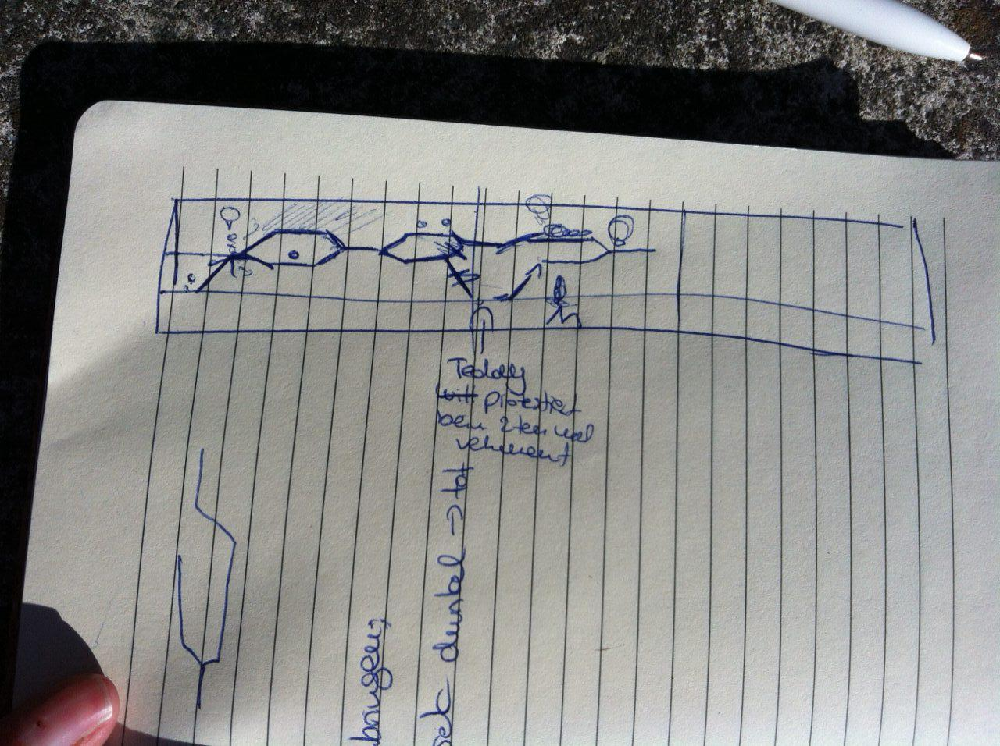

# one-night-at-lunaland

| Aufgabe | Zugewiesen an | Status | Notiz |
| ------- | ------------- | ------ | ----- |
| Grafik in Level einbinden| Johannes | TODO | Auch Pfade an Optik anpassen|
| Soundsystem in Unity | Jan | TODO | |
| Sounds rausschen | Mike | TODO | selbstgemacht? |
| Musik einbinden | Jan | TODO | |
| Gefahr anzeigen bei safety <= x | Jan | TODO | Canvas-UI gesteuert über GameLogic.cs |
| Balancing| Johannes | in Progress | Zeit und Itemverteilung |
| Sprechblasen | Jan | in Progress | überlappen noch |
| Bilder | Karo, Matthias | in Progress | ^^ |
| Animation | Mathias, Jan | in Progress | Sieht schon gut aus |
| Eingesprochene Texte (Synchro) | Karo | Fertig | Noch einbinden |
| Prototyp| Johannes, Jan, Karsten | Fertig |
| Pickup aktiv aufnehmen (Space) | Jan | Fertig | Update in ItemPickup.cs |
| Levels | Johannes | Fertig | Grafik fehlt noch |
| Gefahr abwehren durch quicktime (Space) | Jan | Fertig | UI + GameLogic.cs |
| Was passiert bei Tod | Jan, Johannes | Fertig | Respawn an Save |
| Bild drehen | Karsten | Fertig | von Johannes übernommen |

## Notizen

Jeder Weg, der nach oben geht muss auch wieder ohne runterzufallen nach unten führen, sonst

<pre>
    /---------- v (runterfallen)
___/   <-- da ist dann ne Wand           
</pre>
